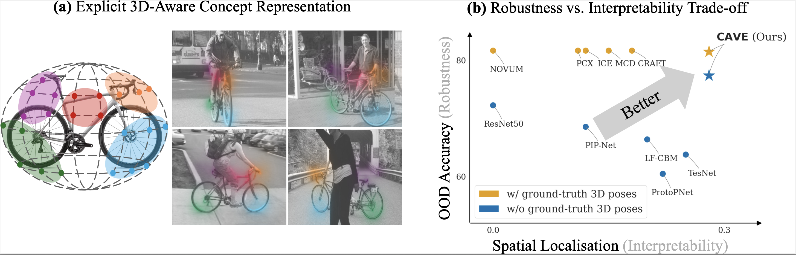
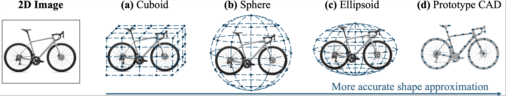
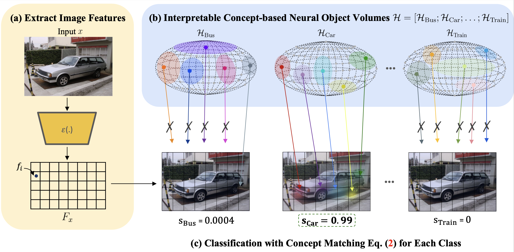

# CAVE: Interpretable 3D Neural Object Volumes for Robust Conceptual Reasoning
<a href="https://phamleyennhi.github.io/">Nhi Pham</a><sup>1</sup>,
<a href="https://artur.jesslen.ch/">Artur Jesslen</a><sup>2</sup>,
<a href="https://www.mpi-inf.mpg.de/departments/computer-vision-and-machine-learning/people/bernt-schiele">Bernt Schiele</a><sup>1</sup>,
<a href="https://genintel.mpi-inf.mpg.de/">Adam Kortylewski</a><sup>*3</sup>,
<a href="https://explainablemachines.com/members/jonas-fischer.html">Jonas Fischer</a><sup>*1</sup>

<sup>\*</sup>Equal senior advisorship

<sup>1</sup>Max Planck Institute for Informatics, Saarland Informatics Campus, Germany

<sup>2</sup>University of Freiburg, Germany

<sup>3</sup>CISPA Helmholtz Center for Information Security, Germany

[](https://arxiv.org/abs/2503.13429)
[](https://phamleyennhi.github.io/cave/)

## 📣 News

- [26-02-01] Our paper is accepted to ICLR 2026!
- [25-09-10] Code is available soon, stay tuned!
- [25-09-04] 👀 Release of [arXiv](https://arxiv.org/abs/2503.13429) paper and [project website](https://phamleyennhi.github.io/cave/).

## Contents

<!-- - [🌐 Project Website](https://phamleyennhi.github.io/cave/) -->

- [📓 Abstract](#-abstract)
- [🛠️ Installation](#️-installation)
- [💾 Datasets & Checkpoints](#-datasets--checkpoints)
- [📣 Usage](#-usage)
- [📘 Citation](#-citation)

## 📓 Abstract


With the rise of neural networks, especially in high-stakes applications, these networks need two properties (i) robustness and (ii) interpretability to ensure their safety. Recent advances in classifiers with 3D volumetric object representations have demonstrated greatly enhanced robustness in out-of-distribution data. However, these 3D-aware classifiers have not been studied from the perspective of interpretability. We introduce CAVE - Concept Aware Volumes for Explanations - a new direction that unifies interpretability and robustness in image classification. We design an inherently-interpretable and robust classifier by extending existing 3D-aware classifiers with concepts extracted from their volumetric representations for classification. In an array of quantitative metrics for interpretability, we compare against different concept-based approaches across the explainable AI literature and show that CAVE discovers well-grounded concepts that are used consistently across images, while achieving superior robustness.

## 🛠️ Installation

To get started, create a virtual environment using Python 3.12+:

```bash
python3.12 -m venv cave
source cave/bin/activate
pip install -r requirements.txt
```

## 💾 Datasets & Checkpoints

### Datasets

We evaluate our methods on three datasets that provide 3D annotations, namely Pascal3D+ (with different occlusion levels), OOD-CV, and ImageNet3D. We followed NOVUM's data preparation [here](https://github.com/GenIntel/NOVUM). Note that the annotations can be replaced with estimated poses from Orient-Anything during data preparation. We provided an example dataloader for Pascal3D+ in `src/dataset`.

### Checkpoints

We provide pretrained NOVUM models with **ellipsoidal** neural volumes, using both ground-truth and estimated Orient-Anything pose annotations. These models are released as part of CAVE v1.0.0 and can be downloaded from [here](https://github.com/phamleyennhi/CAVE/releases/tag/v1.0.0). We will soon release the checkpoints for other neural volume shapes.



## 📣 Usage

### CAVE : A 3D-Aware Inherently Interpretable Classifier



### LRP with Conservation for CAVE (and NOVUM)

We adapt the Layer-Wise Relevance Propagation (LRP) implementation for ResNet from
https://github.com/keio-smilab24/LRP-for-ResNet to support the **NOVUM** and **CAVE**
models. This release provides a modified `lrp.py` and `lrp_layers.py` that is compatible with NOVUM and CAVE while preserving the original LRP formulation and conservation properties.

1. Clone the original repository:

   ```
   cd ./CAVE/third_party/
   git clone https://github.com/keio-smilab24/LRP-for-ResNet.git
   cd LRP-for-ResNet
   ```

2. Replace the original `lrp.py` and `lrp_layers.py` with the adapted version provided in this
   repository. Then, LRP can be applied to NOVUM and CAVE models using the upstream codebase to generate relevances and visualisations.

### Evaluation

The `src/evaluation` folder provides scripts for evaluating different aspects of CAVE's interpretability and robustness. Here we include our proposed metric `3D Consistency`. You can use these modules to compute a variety of metrics:

- **3D Consistency (ours)** (`3d_consistency.py`):
  Evaluates how well predicted 3D shapes and poses match the ground truth using mesh rendering and camera pose.

- **Global Coverage** (`global_coverage.py`):
  Computes the coverage of generated class explanations w.r.t all semantic human-annotated parts (concepts) for an object.

- **Localisation** (`localisation.py`):
  Quantifies how well an explanation generated by a method overlaps with the ground-truth human-annotated object part. This takes into account both attribution strength and IoU between the explanation and the annotated part.

## 📘 Citation

When using this code in your project, consider citing our work as follows:

<section class="section" id="BibTeX">
  <div class="container is-max-desktop content">
    <pre><code>@inproceedings{pham26interpretable,
    title     = {Robust Conceptual Reasoning through Interpretable 3D Neural Object Volumes},
    author    = {Pham, Nhi and Jesslen, Artur and Schiele, Bernt and Kortylewski, Adam and Fischer, Jonas},
    booktitle = {The Fourteenth International Conference on Learning Representations},
    year      = {2026},
    url       = {https://openreview.net/forum?id=VSPLa2Sito}
}</code></pre>
  </div>
</section>

## Acknowledgements

We thank Christopher Wewer for insightful discussions on 3D consistency evaluation, and careful proofreading of our paper. This codebase is built upon NOVUM's codebase - many thanks to Artur!
