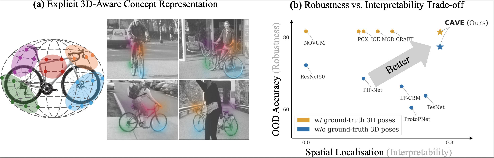
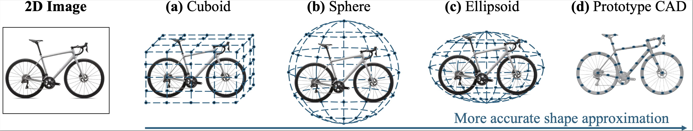
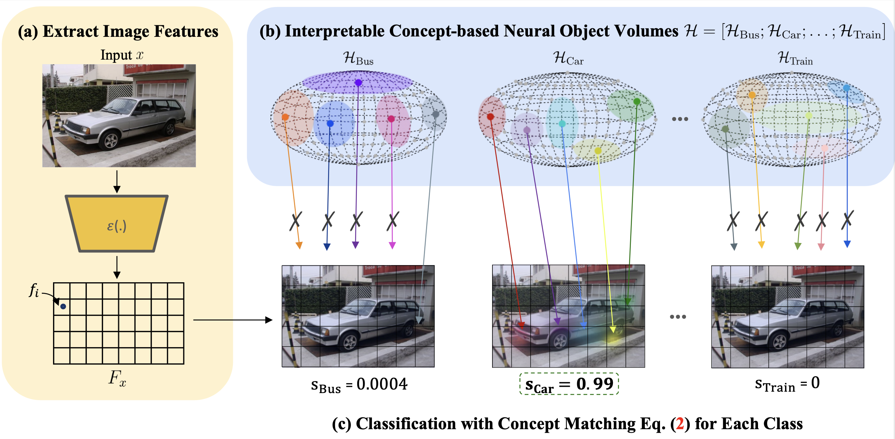

# CAVE: Interpretable 3D Neural Object Volumes for Robust Conceptual Reasoning

<a href="https://phamleyennhi.github.io/">Nhi Pham</a><sup>1</sup>,
<a href="https://artur.jesslen.ch/">Artur Jesslen</a><sup>2</sup>,
<a href="https://www.mpi-inf.mpg.de/departments/computer-vision-and-machine-learning/people/bernt-schiele">Bernt Schiele</a><sup>1</sup>,
<a href="https://genintel.mpi-inf.mpg.de/">Adam Kortylewski</a><sup>*3</sup>,
<a href="https://explainablemachines.com/members/jonas-fischer.html">Jonas Fischer</a><sup>*1</sup>

<sup>\*</sup>Equal senior advisorship

<sup>1</sup>Max Planck Institute for Informatics, Saarland Informatics Campus, Germany

<sup>2</sup>University of Freiburg, Germany

<sup>3</sup>CISPA Helmholtz Center for Information Security, Germany

[](https://arxiv.org/abs/2503.13429)
[](https://phamleyennhi.github.io/cave/)
[](https://openreview.net/forum?id=VSPLa2Sito)

> **CAVE is the first framework to connect concept-based interpretability with robust 3D-aware classification by grounding sparse visual concepts in neural object volumes and evaluating their spatial consistency under distribution shift.**

## 📣 News

- [26-02-01] Our paper is accepted to ICLR 2026!
- [25-09-10] Code is available soon, stay tuned!
- [25-09-04] 👀 Release of [arXiv](https://arxiv.org/abs/2503.13429) paper and [project website](https://phamleyennhi.github.io/cave/).

## Contents

- [📓 Abstract](#-abstract)
- [🗺️ Overview](#️-overview)
- [✅ Use CAVE If…](#-use-cave-if)
- [⚡ 10-Minute Quickstart](#-10-minute-quickstart)
- [🛠️ Installation](#️-installation)
- [💾 Datasets & Checkpoints](#-datasets--checkpoints)
- [📣 Usage](#-usage)
- [📐 3D Consistency (3D-C): A Standalone Evaluation Metric](#-3d-consistency-3d-c-a-standalone-evaluation-metric)
- [ Limitations & Open Problems](#-limitations--open-problems)
- [📘 Citation](#-citation)

## 📓 Abstract


With the rise of neural networks, especially in high-stakes applications, these networks need two properties (i) robustness and (ii) interpretability to ensure their safety. Recent advances in classifiers with 3D volumetric object representations have demonstrated greatly enhanced robustness in out-of-distribution data. However, these 3D-aware classifiers have not been studied from the perspective of interpretability. We introduce CAVE - Concept Aware Volumes for Explanations - a new direction that unifies interpretability and robustness in image classification. We design an inherently-interpretable and robust classifier by extending existing 3D-aware classifiers with concepts extracted from their volumetric representations for classification. In an array of quantitative metrics for interpretability, we compare against different concept-based approaches across the explainable AI literature and show that CAVE discovers well-grounded concepts that are used consistently across images, while achieving superior robustness.

## 🗺️ Overview

CAVE contributes three components that can be used and referenced independently:

- **CAVE classifier** — an inherently interpretable, robust image classifier grounding concepts in 3D neural object volumes.
- **Concept-aware neural volumes** — a representation that supports both robust classification and concept-level explanations. Concept bottleneck models require concepts to be pre-specified and annotated at training time; CAVE shows that a 3D volumetric object representation can serve as a natural, annotation-free concept coordinate system that is grounded in geometry and stable across viewpoints.
- **3D Consistency (3D-C)** — a metric for evaluating whether explanation attributions remain spatially stable across viewpoints and distribution shifts; applicable to any explanation method with access to object pose.

### Relation to Concept Bottleneck Models

CAVE is related to Concept Bottleneck Models in that it factors classification through an interpretable intermediate representation. However, instead of using a flat vector of human-defined concepts, CAVE grounds concepts in 3D neural object volumes. This allows concepts to be localized in object-centric space and evaluated for spatial consistency across viewpoints and distribution shifts. In this sense, CAVE can be viewed as exploring a spatial, object-centric alternative to classical concept bottlenecks.

## ✅ Use CAVE If…

- You need **robust image classification** whose decisions can be explained by human-interpretable visual concepts.
- You want concepts that **remain spatially consistent** under viewpoint changes, occlusion, or OOD distribution shifts.
- You are looking for a **3D-grounded concept baseline** to compare against in your XAI or robustness paper.
- You want to evaluate explanation stability using **3D Consistency (3D-C)** without requiring CAVE's full pipeline.
- You are building on top of neural object volume classifiers and want to add interpretability.
- You work on **concept bottleneck models** and are interested in how object geometry can reduce the annotation burden for defining concepts, or in how 3D structure can make bottleneck concepts more spatially stable under viewpoint and distribution shift.

## ⚡ 10-Minute Quickstart

Run a pretrained CAVE model, generate a concept explanation, and compute a 3D-C score in under 10 minutes.

**1. Install**

```bash
python3.12 -m venv cave && source cave/bin/activate
pip install -r requirements.txt
```

**2. Download a pretrained checkpoint**

Download a pretrained ellipsoidal CAVE checkpoint from the [v1.0.0 release](https://github.com/phamleyennhi/CAVE/releases/tag/v1.0.0) and place it under `checkpoints/`.

**3. Run inference and generate a concept explanation**

```bash
# Run CAVE on a single Pascal3D+ image and visualise concept attributions
python src/inference.py \
    --config config/cave_pascal3d.yaml \
    --checkpoint checkpoints/cave_pascal3d_ellipsoid.pth \
    --image examples/aeroplane_000001.jpg
```

**4. Compute 3D Consistency**

```bash
python src/evaluation/3d_consistency.py \
    --config config/cave_pascal3d.yaml \
    --checkpoint checkpoints/cave_pascal3d_ellipsoid.pth \
    --dataset P3DImageNet \
    --cls_idx 0
```

The script prints the per-class 3D-C score and saves a heatmap of concept-to-surface projections.

## 🛠️ Installation

To get started, create a virtual environment using Python 3.12+:

```bash
python3.12 -m venv cave
source cave/bin/activate
pip install -r requirements.txt
```

## 💾 Datasets & Checkpoints

### Datasets

We evaluate our methods on three datasets that provide 3D annotations, namely Pascal3D+ (with different occlusion levels), OOD-CV, and ImageNet3D. We followed NOVUM's data preparation [here](https://github.com/GenIntel/NOVUM). Note that the annotations can be replaced with estimated poses from Orient-Anything during data preparation. We provided an example dataloader for Pascal3D+ in `src/dataset`.

### Checkpoints

We provide pretrained NOVUM models with **ellipsoidal** neural volumes, using both ground-truth and estimated Orient-Anything pose annotations. These models are released as part of CAVE v1.0.0 and can be downloaded from [here](https://github.com/phamleyennhi/CAVE/releases/tag/v1.0.0). We will soon release the checkpoints for other neural volume shapes.



## 📣 Usage

### CAVE: A 3D-Aware Inherently Interpretable Classifier



### LRP with Conservation for CAVE (and NOVUM)

We adapt the Layer-Wise Relevance Propagation (LRP) implementation for ResNet from
https://github.com/keio-smilab24/LRP-for-ResNet to support the **NOVUM** and **CAVE**
models. This release provides a modified `lrp.py` and `lrp_layers.py` that is compatible with NOVUM and CAVE while preserving the original LRP formulation and conservation properties.

1. Clone the original repository:

   ```bash
   cd ./CAVE/third_party/
   git clone https://github.com/keio-smilab24/LRP-for-ResNet.git
   cd LRP-for-ResNet
   ```

2. Replace the original `lrp.py` and `lrp_layers.py` with the adapted version provided in this
   repository. Then, LRP can be applied to NOVUM and CAVE models using the upstream codebase to generate relevances and visualisations.

## 📐 3D Consistency (3D-C): A Standalone Evaluation Metric

**3D Consistency (3D-C)** is an explanation evaluation metric that measures whether a method's concept attributions remain spatially stable when the same object is viewed from different viewpoints, under occlusion, or under distribution shift. It does this by projecting pixel-level attributions onto the shared 3D surface of the object and comparing the resulting surface distributions across images.

3D-C can be applied to **any explanation method** — it does not require CAVE. If your method generates spatial attributions and you have access to object pose or 3D geometry, you can use 3D-C to measure stability.

### Minimal API

```python
from src.evaluation.3d_consistency import compute_3dc

score = compute_3dc(
    concept_attributions,   # (H, W) attribution map for one image
    object_mesh,            # pytorch3d Meshes object
    camera_pose,            # (elev, azim, theta, dist) spherical angles
    pix_to_face_fn,         # callable: (mesh, pose) -> (H, W) face index map
)
# score ∈ [0, 1], higher = more spatially consistent across views
```

### Full evaluation over a dataset

```bash
python src/evaluation/3d_consistency.py \
    --config config/cave_pascal3d.yaml \
    --dataset P3DImageNet \
    --cls_idx 0          # 0 = aeroplane, see config for full list
```

The `src/evaluation` folder provides scripts for all reported metrics:

- **3D Consistency (ours)** (`3d_consistency.py`):
  Projects concept attributions onto the 3D object surface and evaluates spatial stability across viewpoints and OOD conditions — without relying on 2D part annotations.

- **Global Coverage** (`global_coverage.py`):
  Computes the coverage of generated class explanations w.r.t. all semantic human-annotated parts (concepts) for an object.

- **Localisation** (`localisation.py`):
  Quantifies how well an explanation overlaps with the ground-truth human-annotated object part, accounting for both attribution strength and IoU.

## Limitations & Open Problems

We list open problems explicitly so that follow-up work can build on CAVE and cite it as a starting point:

- **Scaling beyond annotated categories.** CAVE currently requires object categories with 3D CAD models and pose annotations. Extending to categories without such annotations (e.g., via CAD retrieval or neural fields) is an open direction.
- **Noisy or estimated geometry.** 3D-C assumes reasonably accurate pose. Extending it to handle estimated or noisy geometry (e.g., from Orient-Anything or monocular depth) would broaden its applicability.
- **Concept intervention.** CAVE identifies and explains concepts, but does not yet support test-time intervention on individual concepts (e.g., removing a concept and observing the effect on the prediction).
- **Beyond classification.** Applying concept-aware neural volumes to detection, segmentation, vision-language models, or generative models is a natural but unexplored extension.
- **Broader evaluation.** 3D-C currently relies on Pascal3D+ / OOD-CV geometry. Adapting it to other datasets (e.g., real scans, synthetic datasets) or modalities (video, multi-view) remains future work.

## 📘 Citation

CAVE contains three citeable contributions. Please cite the paper if you use any of them:

- **CAVE** (the inherently interpretable 3D-aware classifier),
- **concept-aware neural object volumes** (the representation),
- **3D Consistency / 3D-C** (the evaluation metric).

```bibtex
@inproceedings{pham26interpretable,
    title     = {Robust Conceptual Reasoning through Interpretable 3D Neural Object Volumes},
    author    = {Pham, Nhi and Jesslen, Artur and Schiele, Bernt and Kortylewski, Adam and Fischer, Jonas},
    booktitle = {The Fourteenth International Conference on Learning Representations},
    year      = {2026},
    url       = {https://openreview.net/forum?id=VSPLa2Sito}
}
```

## Acknowledgements

We thank Christopher Wewer for insightful discussions on 3D consistency evaluation, and careful proofreading of our paper. This codebase is built upon NOVUM's codebase - many thanks to Artur!
